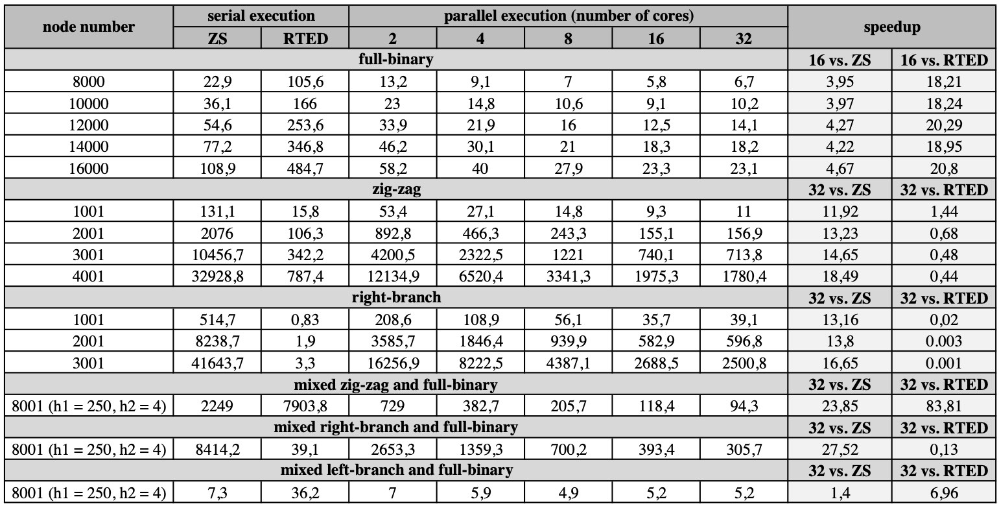

  <h1>Multi Core Tree Edit Distance</h1>

In shared-memory multi-core machines the layout of data in memory, dependency of computation threads and overhead of multithreading
can affect efficiency of programs. In such systems, adding more processors increases the communication load on the shared
data-structures in memory which may lead to performance degradation if they aren’t considered properly.
We designed a multi-core scalable algorithm for computing the so-called tree edit distance.
The tree edit distance is a measure that determines similarity of tree-structured data and is defined as the minimum cost
sequence of edit operations (deletion, insertion, rename) that transforms one tree into the other. For this purpose,
we take advantages of multi-core systems by considering abovementioned issues, to decrease the execution-time of
tree edit distance computation targeting Zhang-Shasha algorithm [1].

<h2> Execution </h2>
<h3> How to compile: </h3>
<ul>
  <li>clang++ -O3 -std=c++11 TreeSim.cpp -lpthread -o mcted</li>
</ul>

<h3> How to execute: </h3>
<ul>
  <li>./mcted -h</li>
</ul>

<h2> Methodology </h2>

<h3> Dependencies Detection: </h3>

To compute the distance between two trees, all the subtrees rooted at each of key-root nodes should be compared.
The computation of the similarity for key-root pairs may be dependent on the similarity of other pairs appearing in decedent subtrees.
Therefore, at each step of computation key-root pairs that can be executed independently are identified and distributed on existing parallel processing units.

  

  Dependencies between key-root nodes

At each step, for identification of independent jobs we use a data-structure that maintains dependencies between subtrees rooted at each of key-root nodes. Each key-root pair depends on all of its decedent key-roots and it can be computed after computation of all of those pairs.
A concurrent pool is used to manage all these independent sub-problems. At each instance of time this pool contains all possible independent sub-problems which can be executed in parallel.

<h3> Concurrent pool: </h3>

In the parallel algorithm all of the threads may want to access to the pool of independent jobs at the same time.
Thus, it may reduce the performance of the parallel algorithm if it is not designed well. In order to prevent racing
between threads which are executing concurrently, we need to come up with a mechanism for synchronization. Considering the pool
as a single queue could be simple but in that case threads which try to modify head or tail elements need to access
those elements serially. We employ the idea of distributed queues as a concurrent pool [3].

  

  Thread pool

<h3> Overhead of Synchronization: </h3>

Different jobs in the pool may have different amount of work to do. This depends on the input tree size.
Due to the overhead of synchronization for concurrently executed threads, for small jobs the amount of overhead is
larger than the gain that we can get from parallel computing.

<h2>Experiments</h2>

  

  Results

<h2>References</h2>

[1] Zhang, Kaizhong, and Dennis Shasha. "Simple fast algorithms for the editing distance between trees and related problems." SIAM journal on computing 18.6 (1989): 1245-1262.
 
[2] tree-edit-distance.dbresearch.uni-salzburg.at
 
[3] Haas et al. "Distributed queues in shared memory: multicore performance and scalability through quantitative relaxation." Proceedings of the ACM International Conference on Computing Frontiers. ACM, 2013.

<h2>Author</h2>

Alireza S. Abyaneh (All rights reserved).

